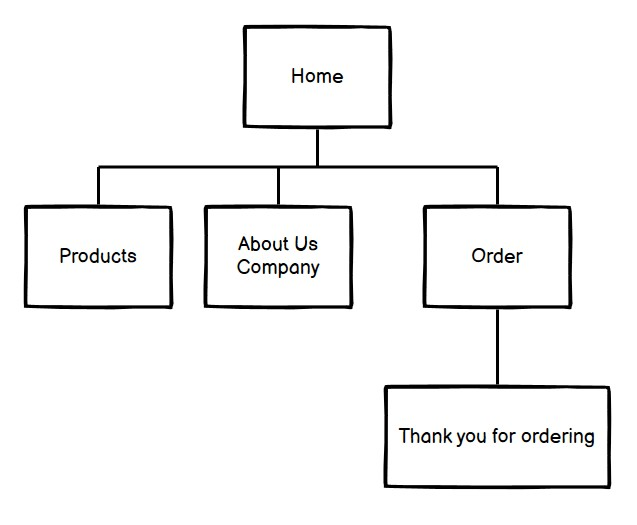
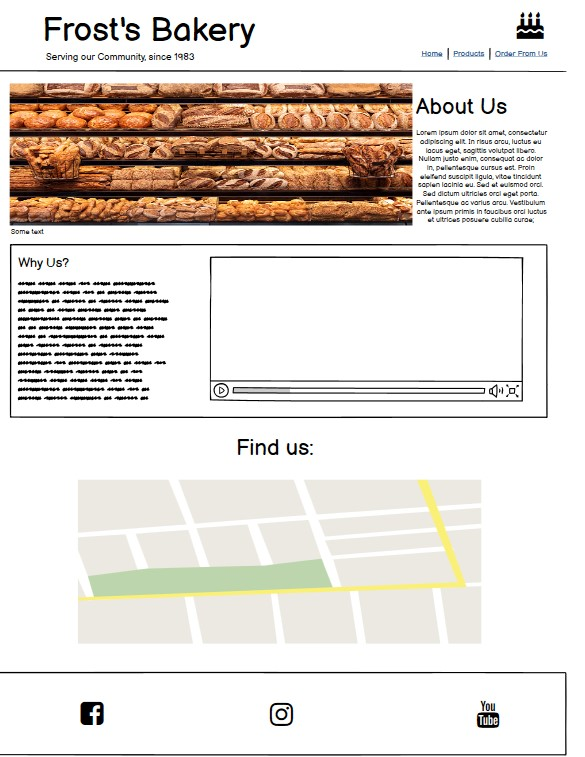
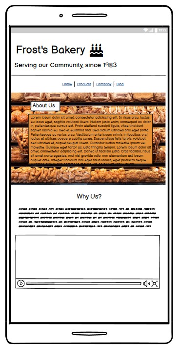
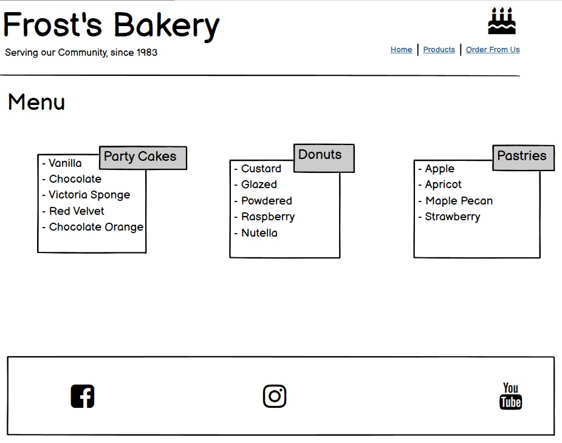
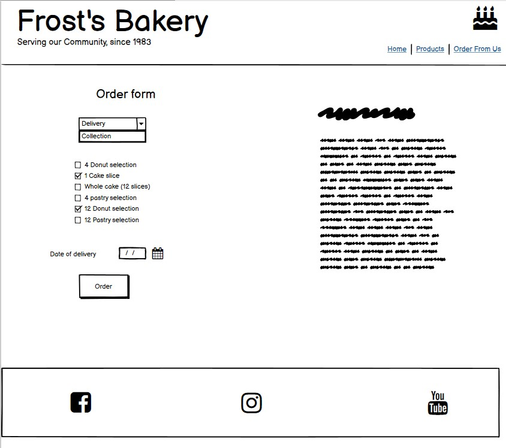
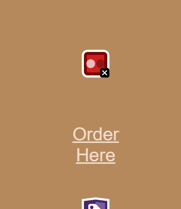

# Frost's Bakery
## Introduction
This project is a bakery's website, alowing users to find out opening and closing times, the bakery's location and menu. As well as place an order for delivery or collection. The site is targeted towards customers of all ages in the local area, it will provide users with ways to find and contact the bakery; as well as be able to see and order the food from the site
## UserExperience
### User stories
1. As a local of the area I would like to be able to find new and exciting options for food and to support the local ecoonomy by avoiding commercial coffee shops and bakeries. 
2. I am looking to buy a cake for an upcoming event, I would like to find and order this online
3. I am new to the area and looking for new bakeries and cafes to try out
4. I would like to visit Canterbury for the day and buy food while I'm there, I am looking for an option in the city center
### User Expectations
1. I expect Information to be laid out in an easy to read manner
2. I expect to be able to find an address and a menu for this buisness
3. I expect to be able to use the website easily, and for it to have a responsive interface
4. I expect to be able to place an order, and for this process to be simple

## Wireframes
### Inital Wireframes used for this project
The inital wireframes do not exactly match the end project, but still show the user a base idea of how the website will look on different pages and devices

    
## Features
### Landing Page

The landing/Index page acts as a home page to the Bakery Website; it has a short about section and a section with the Frost's unique selling point as a way to encourage new customers. There is also a video, demonstrating common baking techniques as a way of inticing customers, the video plays on mute and allows users to pause or play it with the use of controls. The landing page also has a map and address section, which fulfills user expectation 2. 
### Menu 

The menu page contains three boxes which display Unordered lists, these contain different menu items which customers may want to order, fulfilling both expectations 1 and 2.

### Ordering page 

The order page contains information about the ordering process and how it works, which fulfills expectation 1, it also contains an easy to use form to order food and decide whether to have it delivered or collect it, fulfilling expecation 4. 

### Thank you page

The thank you page acts as an order confirmation page, letting customers know that their order from the form has gone through and that their order will be processed. This page also has a back button, allowing users to navigate without needing to use the browser. 

## Features to implement   
## Testing
### Validation
Index passes HTML validation
### Manual Testing
## Accessibility
All images and video content have alt-text provided, all links have attached aria-labels, helping users who need screen readers. The video and image content also has alternate text for people who's browsers does not support the content, as to support the web-content for user's who's browsers don't support HTML5.

The font sizes change with media queries in the CSS file, so the text remains legible at all screen sizes.

Some of the colours used in this project did not score highly enough in acessibility testers for contratst, so different colours were used instead.

## Bug fixes
The footer on pages with less content (ie the Thank You page) does not always stick to the bottom of the screen, often creating quite a large gap between content and the footer. This was resolved by adding the properties 'fixed bottom' to the footer, and in the appropriate media queries

While not a bug, intially the hero image for the order page was too large a file size and was causing lags when opening the page on mobile, this was solved by compressing the image to decrease loading times and to make the site more responsive.
## Deployment
Deployment of this project is done through GitHub pages, a cloud-based web hosting service, which will allow for changes to be made to the website post-deployment, in order to update menus and other details. The code is hosted through Github, allowing people to clone the project if desired.

## Credits
### Media 
- Royalty free baking video By Taryn Elliot [Sourced from Pexels](https://www.pexels.com/video/stirring-flour-and-condensed-milk-in-a-mixing-bowl-3325984/)
- Royalty free pastry picture By Skyler Ewing [Sourced from Pexels](https://www.pexels.com/photo/freshly-baked-bread-with-cinnamon-9513725/)
### Other content
[Social media icons from Font Awesome](https://fontawesome.com/search?s=solid%2Cbrands)
#### Fonts through out the website 
- ['Arsenal' By Andrij Shevchenko](https://fonts.google.com/specimen/Arsenal?query=arsenal)
- ['Nothing you can do' by Kimberly Geswein](https://fonts.google.com/specimen/Nothing+You+Could+Do?query=nothing+)